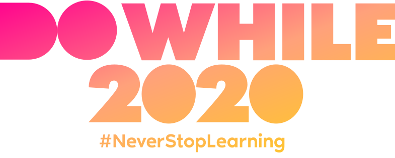

  

<h2 align="center">
  <b>API GraphQL in Node.js and TypeScript with TypeGraphQL</b>
</h2>

### Informations

This project was developed based on a workshop held at the DoWhile 2020, an event organized by Rocketseat, with the theme "Creating API GraphQL in Node.js and TypeScript with TypeGraphQL".

Consists of a simple system for creating and reading videos and categories

### Build With
  - [GraphQL](https://graphql.org) - Query language
  - [TypeGraphQL](https://typegraphql.com) - Framework for GraphQL in Node.js
  - [MongoDB Atlas](https://cloud.mongodb.com) - Cloud database service for MongoDB
  - [Mongoose](https://mongoosejs.com) - MongoDB object modeling tool

---

Made with :sparkling_heart: by Gabriel Ribeiro